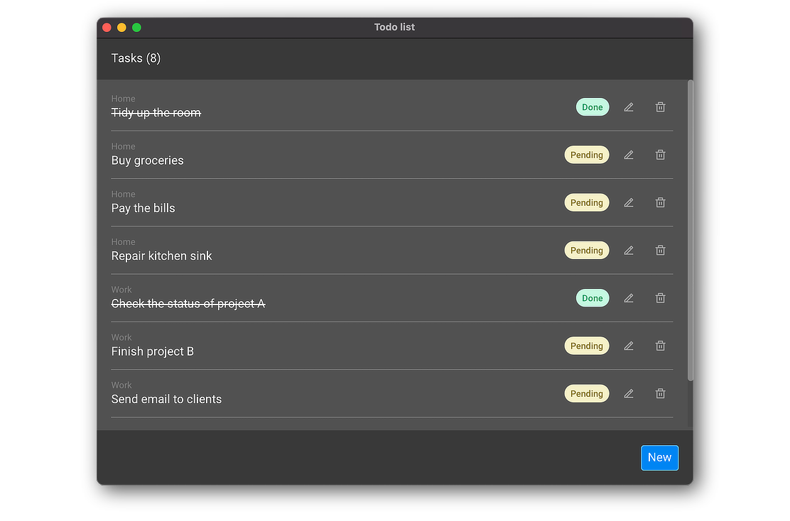

# Monomer

An easy to use, cross platform, GUI library for writing native Haskell
applications.

It provides a framework similar to the Elm Architecture, allowing the creation
of GUIs using an extensible set of widgets with pure Haskell.

## Screenshot

## Objectives

- Be easy to learn and use.
- Be extensible with custom widgets.
- Run on Windows, Linux and macOS.
- Have good documentation.
- Have good examples.

### These are not objectives for this project

- Have a native look and feel.

### Why would you want to use this library?

- You want to write your application in Haskell.
- You want to write a native, not web based, application.

## Documentation

### Setup

You can read how to setup your environment [here](docs/tutorials/00-setup.md).

### Tutorials

Introductory tutorials are available:

- [01 - Basics](docs/tutorials/01-basics.md)
- [02 - Styling](docs/tutorials/02-styling.md)
- [03 - Life cycle](docs/tutorials/03-life-cycle.md)
- [04 - Tasks](docs/tutorials/04-tasks.md)
- [05 - Producers](docs/tutorials/05-producers.md)
- [06 - Composite](docs/tutorials/06-composite.md)
- [07 - Custom widgets](docs/tutorials/07-custom-widgets.md)
- [08 - Themes](docs/tutorials/08-themes.md)

### Examples

Beyond the tutorials, a few _real world like_ examples are available:

- [Todo](docs/examples/01-todo.md)
- [Books](docs/examples/02-books.md)
- [Ticker](docs/examples/03-ticker.md)
- [Generative](docs/examples/04-generative.md)

### Haddock

You can read the source code's documentation [here](https://hackage.haskell.org/package/monomer).

### Design decisions

In case you wonder why some choices were made, you can read
[here](docs/design-decisions.md).

## Roadmap

- Stability and performance.
- Mobile support.

## Contributing

PRs are welcome!

If possible, keep them small and focused. If you are planning on making a large
change, please submit an issue first so we can agree on a solution.

## License

This library is licensed under the [BSD-3 license](LICENSE).

Fonts used in the examples:

- [Roboto](https://fonts.google.com/specimen/Roboto), licensed under the [Apache license](http://www.apache.org/licenses/LICENSE-2.0).
- [Remix Icon](https://remixicon.com), licensed under the [Apache license](http://www.apache.org/licenses/LICENSE-2.0).

## Acknowledgments

- Thanks to [Ghislaine Guerin](https://github.com/ghislaineguerin) for UX advise.
- Thanks to [Mikko Mononen](https://github.com/memononen) for the amazing [nanovg](https://github.com/memononen/nanovg) library.
