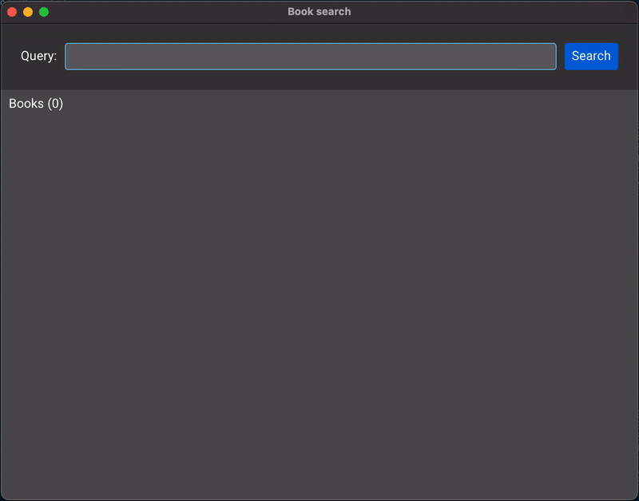

# Example 02 - Books

## Description

This example shows a UI for searching books. It uses an https endpoint provided
by Internet Archive's _Open Library_, which allows querying books using any
piece of information (title, authors, ISBN, etc).

## Preview



## Interesting bits

The BookTypes module defines, besides all the needed types, the
[Aeson](https://hackage.haskell.org/package/aeson) instances used to deserialize
the JSON response returned by the API. Only a few fields are retrieved and
displayed in the UI, but quite a few more are available.

The `BooksSearch` event is used to run a Task that calls the https endpoint.
When a successful response is received, and event with the result is sent back
to the application. The same happens with errors, which are displayed as an
alert dialog.

The zstack widget is used to always keep the background visible while showing
details or errors. Unless specifically requested, input is only received by the
top layer of zstack.

A `box` with the `mergeRequired` configuration option set is used to avoid
running the merge process on the result widgets whenever the model changes. This
happens when the user inputs text, a dialog is displayed and other scenarios.
This is an optimization and should not be needed unless performance is a concern
(for example, when a long list of items is displayed).

```haskell
booksChanged old new = old ^. books /= new ^. books

box_ [mergeRequired booksChanged] $
  vscroll (vstack (bookRow wenv <$> model ^. books)) `nodeKey` "mainScroll"
```
