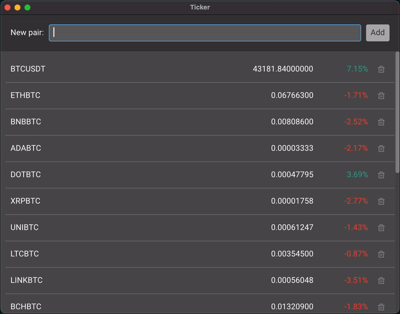

# Example 03 - Ticker

## Description

This example shows a ticker of cryptocurrencies, consuming Binance's websockets
API.

Why were cryptocurrencies used for the example? The objective was showing a
real time streaming API and, to make the example easy to use, that API needed to
be free to use and not require user registration. No other available service
satisfied those constraints with the same amount of constantly changing data.

## Preview

## Interesting bits

On startup a channel is created. It is used to send subscribe/unsubscribe
requests to the thread handling the communication with the remote API.

During the `TickerInit` event, a `Producer` is launched. This producer, which
runs on a separate thread from the application as `Task` do, performs these
steps:

- Connects to the websockets API.
- Launches a new thread for receiving ticker data. A separate thread is required
  because the producer also needs to receive messages from the application.
- Subscribes to the initial ticker list.
- Waits for application messages on its initial thread.

From that point on:

- When a new message from the API is received, it is feed into the application
  using the provided `sendMsg` function.
- When a message from the application is received, it is formatted and forwarded
  to the server.

The `TickerIgnore` event is used in Tasks that process errors and don't
currently feed information into the application. In general you will want to
report these errors to the user, but this is useful at prototyping time.

## Possible improvements

Since updates for each coin are received as individual messages, triggering a
model change every time, it would be desirable to process them as a single batch
when several messages are received within milliseconds. Grouping these messages
and only updating the model once or twice per second can provide more
predictable performance.

One way to do this is to:

- Launch an extra thread (forkIO) before calling `receiveWs`.
- Have `receiveWs` write to a channel where this new thread listens to, instead
  of directly writing to the application with `sendMsg`.
- Use `threadDelay` on the new thread to wait for as long as desired, and read
  the available messages from the channel without blocking (`tryReadTChan`).
  Only then, if new messages were indeed received, send a single message with
  all the results to the application (`TickerUpdate` will have to be modified to
  receive a list instead of a single message). Use `forever` to repeat while the
  application is running.
