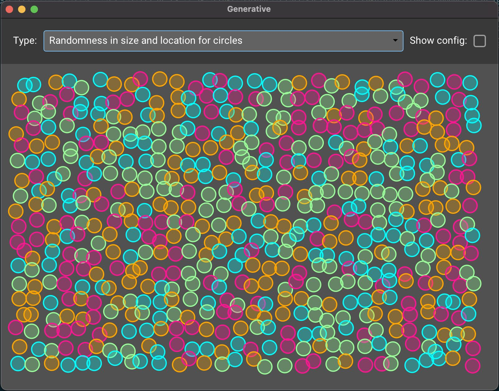

# Example 04 - Generative

## Description

This example is a really basic attempt at generative art. The objective is
creating custom widgets that play a bit with the rendering API.

## Preview

Gif not available because the file is too big (4-5Mb).

## Interesting bits

Both widgets provide customization options for size, randomness and style. The
UI for modifying these configuration options is handled by the application, not
the individual widgets, and serves as an example on how integrating larger,
customizable, pieces into a single application can work.

This example uses the dial widget. It provides functionality similar to slider,
but does so with smaller size requirements.
