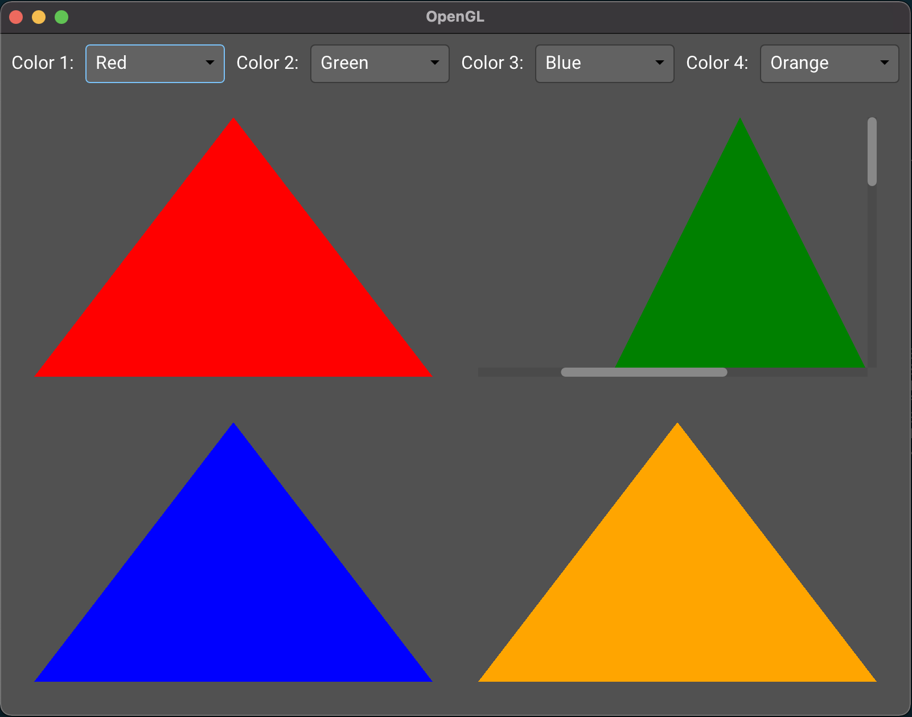

# Example 05 - Custom OpenGL

## Description

This example provides the basics for implementing a widget using custom OpenGL
rendering without using Monomer's Renderer interface. It explains how to
integrate OpenGL into a Monomer application without focusing on OpenGL's best
practices.

## Preview

## Interesting bits

### Resource initialization

Rendering APIs, OpenGL in particular, impose restrictions on multi-threading. In
general a single thread is allowed to call rendering APIs for a given render
context. Calling these APIs from a different thread usually results in a crash.

Monomer handles rendering in an isolated OS thread. The render function of a
widget will be invoked from this thread, but any other functions will not. In
particular, when using `RunTask` or `RunProducer`, the provided actions will not
be run in the rendering thread. Calling OpenGL functions from a `RunTask` action
will result in a crash.

To simplify the initialization of rendering API resources Monomer provides
`RunInRenderThread`, which is equivalent to `RunTask` except it runs in the
rendering thread. The task should limit itself to rendering API initialization
related tasks.

In the example the `init` function takes care of loading the vertex and fragment
shaders that will be used for rendering, and also for allocating the Vertex
Array Object and Vertex Buffer Object. The ids of these buffers are stored in
the widget's state for further usage, and a `RenderOnce` request is made to make
sure the initial version of the widget is displayed correctly. The `dispose`
function, also using `RunInRenderThread`, takes care of releasing these OpenGL
resources. As in other widgets, it is important to implement merge to keep the
current widget state when the UI is rebuilt.

### Rendering passes

Each widget implements the render function to display its content, and each
widget instance is invoked in the order defined by the widget tree (depth first,
child widgets rendering on top of their parent's content). This is in general
enough, but some widgets need to render on top of all the existing content. The
`createOverlay` function provides this functionality, receiving an IO action
that will be run after the normal render pass. The dropdown widget uses this to
render its list when in open state.

Two additional rendering passes exist. When doing low level rendering, calling
API functions directly may cause issues because of expectations regarding OpenGL
state. To overcome this, a pair of functions exist: `createRawTask` and
`createRawOverlay`. In the example only `createRawTask` is used.

The order of the render passes is:

- Regular render calls
- Raw tasks
- Regular overlays
- Raw overlays

### Active viewport

A node has a viewport that represents its assigned region for rendering. When
its render function is called the widget can draw freely inside this region,
although it may not be completely visible: the widget could be partially outside
the screen or wrapped in a scroll widget. The currently visible region can be
found in the `viewport` field of `WidgetEnv`. Also important is the `offset`
field, generally updated by the scroll widget.

When using the Renderer interface this is usually transparent, except for
optimization purposes. Since custom rendering happens _after_ the Renderer pass,
this has to be managed explicitly.

### Coordinates

In Monomer, y = 0 represents the top of the screen. Depending on how the vertex
shader is implemented you may need to transform the active viewport (for
scissoring) and the node's viewport. In this example the vertex shader does not
perform any kind of transformation, so both x and y run from -1 to 1; this is
the reason for the addition/substraction of w/2 and h/2.

### Device pixel rate

The remaining thing to consider is the Device Pixel Rate, or dpr. While Monomer
takes care of dpr scaling when using the Renderer interface, it needs to be
considered when doing low level rendering. In this example the dpr is only used
for scissoring calculations but, depending on how you handle projections, you
may need to consider it when transforming coordinates too.
